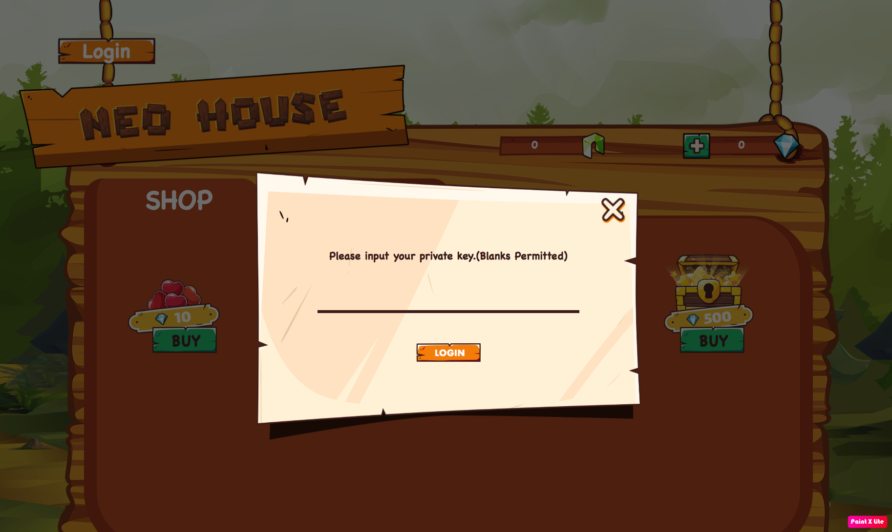
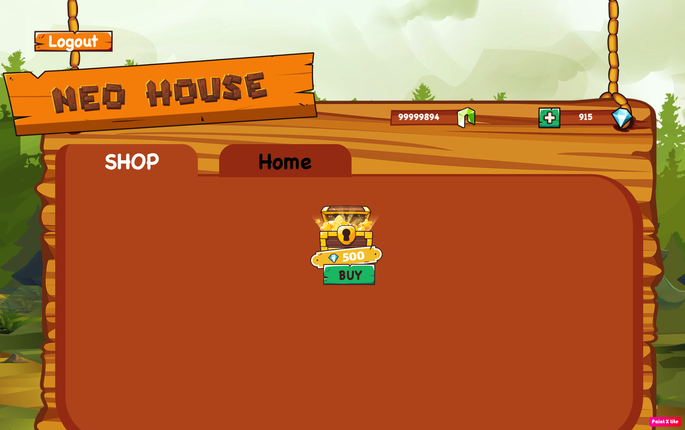
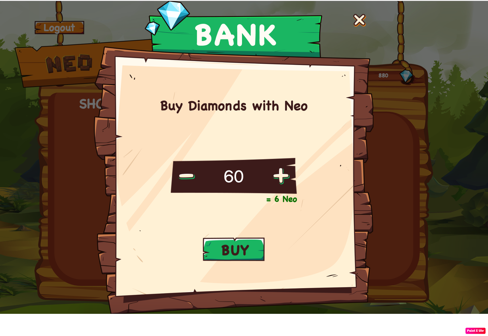
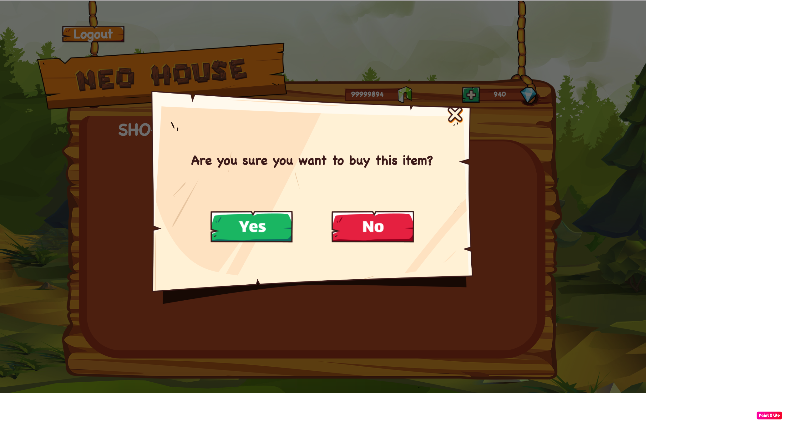
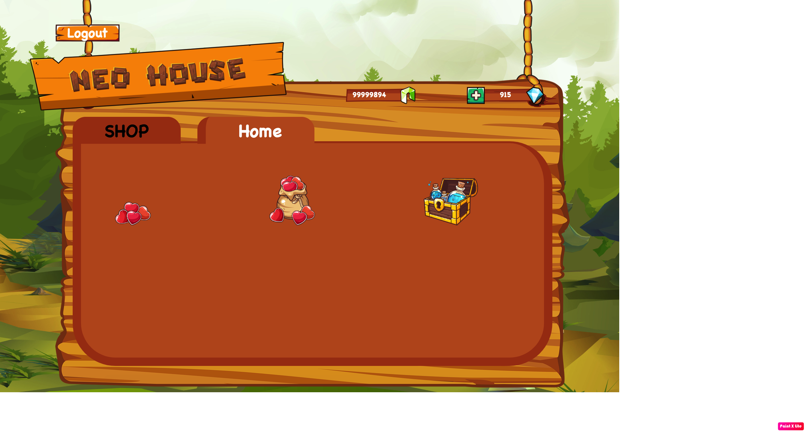

# dApp Demo

This is a simple guide showing how to play the demo dapp (after the dapp has been successfully deployed).

1. Get your private key

Firstly, we need to login to the app by using your private key.

To get your private key, go to the wallet and run command `neo> wallet export wif {address}`
Example: 
```
neo> wallet export wif AK2nJJpJr6o664CWJKi1QRXjqeic2zRp8y
[wallet password]> **********
WIF: KxDgvEKzgSBPPfuVfw67oPQBSjidEiqTHURKSDL1R7yGaGYAeYnr
neo>
```
We get WIF = KxDgvEKzgSBPPfuVfw67oPQBSjidEiqTHURKSDL1R7yGaGYAeYnr to login to the dApp.

Or you can get the private key from information of the private network in Blockchain Ops.

2. Login

Fill in WIF (private key) and then click on Login button and :


After login, you will see the amount of NEO and Diamond you have in your wallet.  If you want to buy some diamonds click on (+) icon to buy.


Buy more diamond


After clicking Buy, you can see new invocation transaction on blockchain explorer or in neo-python wallet logs ("np-prompt -p" -v, then "wallet open ./mywallet")


3. Buy items

Now let's buy some items you want, when you first time login to dapp, in your tab (Home tab) you don't have any items.

Click buy items and Yes to buy your item.



After buying, Item is moved to home tab (your bank). You also see transaction log on wallet of transaction on blockchain explorer


Your buying will stay forever on blockchain, you can check and reload it any time.
